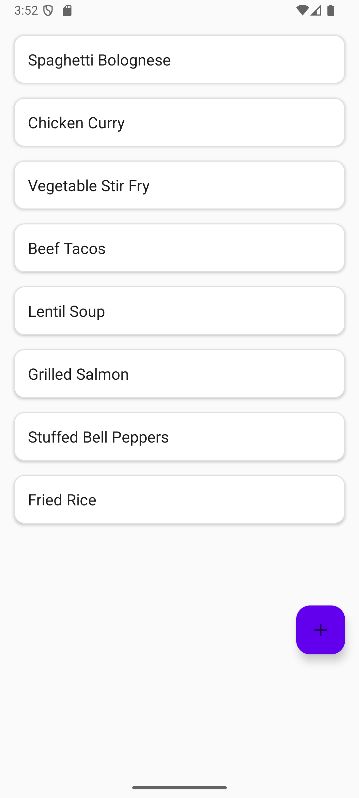
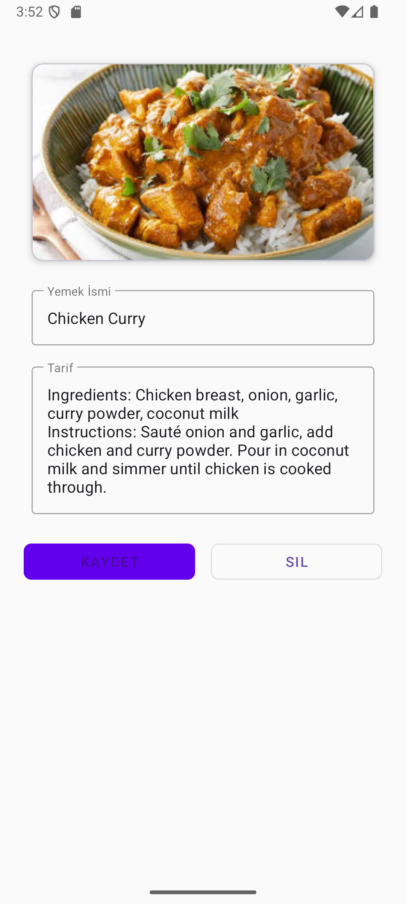

# 🍽️ Recipe Notebook

**Recipe Notes** is a modern Android app that allows users to save recipes. 

---

## 🚀 Features

- ✅ Add, edit, and delete recipes
- ✅ Save ingredients, instructions, and photos for each recipe


---

## 🛠️ Built With

- **Kotlin**
- **Room (SQLite database)**
- **RecyclerView**
- **RxJava**

---

## 📸 Screenshots

<p align="center">
  
  &nbsp;&nbsp;
  
</p>

---

## ⚙️ Getting Started

To get a local copy up and running, follow these simple steps:

1. **Clone the repository**
   ```bash
   git clone https://github.com/yourusername/recipe-notes.git
   ```

2. **Open in Android Studio**

3. **Build and Run**
   - `Build > Rebuild Project`
   - Run on emulator or physical device

> **Minimum SDK:** 24 
> **Target SDK:** 34 

---

## ✍️ Author

**Kerem Levent**  
📧 [keremleventt@gmail.com](mailto:keremleventt@gmail.com)
🔗 [LinkedIn Profile]([https://linkedin.com/in/yourusername](https://www.linkedin.com/in/keremlevent/)) 

---

## 📄 License

This project is licensed under the MIT License – see the `LICENSE` file for details.

---

## 🙌 Contributions

Pull requests are welcome! Feel free to fork the project and submit improvements or suggestions.
